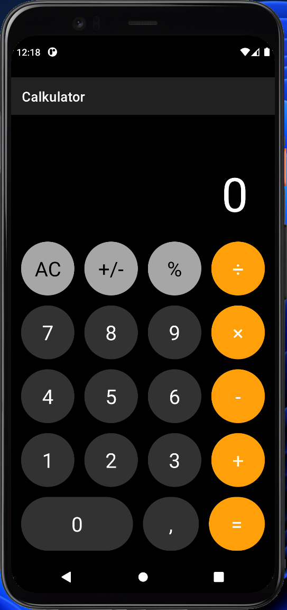
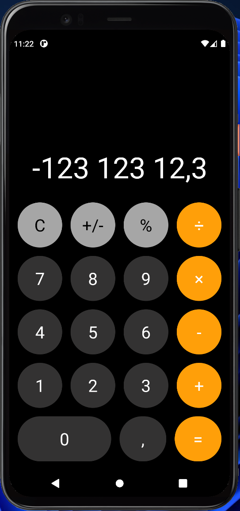

# Calkulator

Calkulator is my second homework on Android Development course at the university.

It's an iOS calculator inspired calculator.

## TODO

- [ ] Document code
- [ ] Write unit tests

## Screenshots

